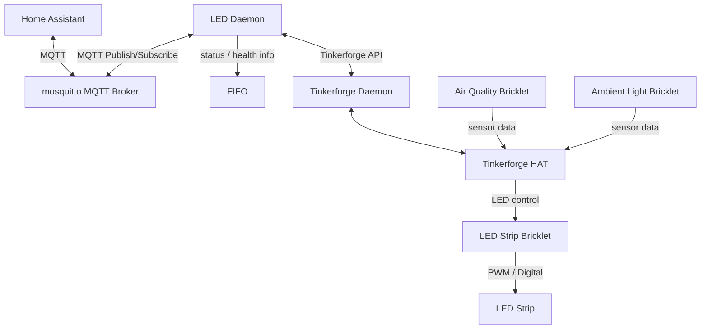

# LED Daemon

## Introduction

led.py is a Python 3 daemon that is meant to run permanently. It gathers data from Tinkerforge bricklets and calculates the brightness and color for the LED strip.

The MQTT integration can send data to mosquitto for visualization and control in Home Assistant.



### Necessary components

- Tinkerforge
  - BrickD Daemon
  - HAT
  - Air Quality Bricklet
  - Ambient Light Bricklet
  - LED Strip Bricklet
- A compatible LED strip (see the compatibility notes in the LED Strip Bricklet 2.0 documentation [LED Strip Bricklet 2.0](https://www.tinkerforge.com/en/shop/led-strip-v2-bricklet.html))

### Optional components

- MQTT server
- Home Assistant

## Features

- Tinkerforge Bricklet data gathering
  - Air Quality Bricklet (temperature, humidity and air pressure sensor, air quality index)
  - Ambient Light Bricklet (light sensor)
  - LED Strip Bricklet (LED controller)
- calculating sunset and sunrise with astral
- setting LED color and brightness based on the gathered values
- sending the measured values to an MQTT server (e.g. mosquitto on Home Assistant)

## Installing and Running on a Raspberry Pi

The daemon can be installed as user root with git:

```sh
cd /opt
git clone https://github.com/sirrus/led.git
```
Please configure the the LED daemon before you start it.

You can use a systemd service or any other service management system if you prefer a cleaner setup.

### Easy installation with rc.local

The easiest way to run the LED daemon is adding this line to `/etc/rc.local`:

```txt
/usr/bin/python3 /opt/led/led.py
```

### Systemd integration

The following definition can be used to enable the LED Daemon as systemd service (save this as `/etc/systemd/system/led-daemon.service`):

```sh
[Unit]
Description=LED Daemon
After=network.target
Wants=network.target

[Service]
Type=simple
User=root
WorkingDirectory=/opt/led
ExecStart=/usr/bin/python3 /opt/led/led.py
Restart=always
RestartSec=5
EnvironmentFile=/opt/led/.env
StandardOutput=journal
StandardError=journal

[Install]
WantedBy=multi-user.target
```

Enable the service:

```sh
sudo systemctl daemon-reload
sudo systemctl enable led-daemon
sudo systemctl start led-daemon
```

You can see daemon logs with:

```sh
journalctl -u led-daemon -f
```

## Needed python3 modules

The following python3 modules are necessary:

- python3-astral
- python3-pydantic
- python3-pydantic-settings
- python3-tinkerforge

## Configuration file .env

The configuration file template can be copied with:

```sh
cp .env-template .env
```

You need to set the values according to your setup.

The following value controls the cycle time by adding a time.sleep() in seconds: `SLEEP=0.3`

The `FIFO` and `LOG` values should use existing paths. The `FIFO` value defines a path for the status FIFO - which can be easily read while the daemon is running. Both values are meant for debugging / logging.

For `FIFO=/tmp/led.py` it can be read like this:

```sh
tail -f /tmp/led.py
```

Set these values to calculate the sunset and sunrise:

- LATITUDE
- ALTITUDE
- TIMEZONE
- COUNTRY
- CITY

You can enable the verbose/debug mode with `DEBUG=True` - or by passing `-d` as command-line parameter.

The `LED` value which enables or disables the LED Strip is meant for initialization only. This value can be set by Home Assistant MQTT. You should set `LED=True` if you are using the LED Daemon without Home Assistant. You can set any initial value (True/False) that fits your needs if you use Home Assistant.

## Tinkerforge

You need to configure the following values:

- TF_HOST = Tinkerforge Server name or IP
- TF_PORT = Tinkerforge Server port
- TF_HATUID = Tinkerforge HAT ID
- TF_LEDUID = Tinkerforge LED Strip Bricklet ID
- TF_AIRUID = Tinkerforge Air Quality Bricklet ID
- TF_LUXUID = Tinkerforge Ambient Light Bricklet ID

## MQTT

MQTT can be enabled with `MQTT_ENABLED=True` or disabled with `MQTT_ENABLED=False`.

The following values must be configured:

- MQTT_BROKER = MQTT server name or IP
- MQTT_PORT = MQTT server port
- MQTT_USER and MQTT_PASS are optional (based on your requirements)
- MQTT_TOPIC = MQTT topic for gathered values (must match with Home Assistant configuration)
- MQTT_SWTOPIC = optional MQTT topic for a switch (must match with Home Assistant configuration)

The LED Daemon will publish the following data during each cycle to Home Assistant:

- temperature
- humidity
- iaq_index
- air_pressure
- illumination

It will subscribe to MQTT topic (MQTT_SWTOPIC) to connect a switch in Home Assistant if MQTT_SWTOPIC is set.

### Sensor data (Publish)

The LED Daemon sends payload with the configured MQTT topic (MQTT_TOPIC) to the configured MQTT server (MQTT_BROKER) as follows (example):

```json
{
  "temperature": 21.6,
  "humidity": 48.2,
  "air_pressure": 1013.4,
  "iaq_index": 42,
  "illumination": 135
}
```

### LED-Status (Subscribe)

The LED Daemon subscribes the configured MQTT topic (MQTT_SWTOPIC) on the configured MQTT server (MQTT_BROKER). The Payload is one of:

- ON
- OFF

## Home Assistant

The Home Assistant integration is based on MQTT. You need to have an MQTT broker installed and you need to add a simple user and set the configuration values (MQTT_User, MQTT_PASS).

Then you need to add an MQTT device (with a name like RaspberryPi), which contains the following entities:

```yaml
mqtt:
  sensor:
    - name: "temperature"
      state_topic: "raspi/sensors"
      unit_of_measurement: "°C"
      value_template: "{{ value_json.temperature }}"
      retain: true

    - name: "humidity"
      state_topic: "raspi/sensors"
      unit_of_measurement: "%"
      value_template: "{{ value_json.humidity }}"
      retain: true

    - name: "illumination"
      state_topic: "raspi/sensors"
      unit_of_measurement: "lx"
      value_template: "{{ value_json.illumination }}"
      retain: true

    - name: "air pressure"
      state_topic: "raspi/sensors"
      unit_of_measurement: "hPa"
      value_template: "{{ value_json.air_pressure }}"
      retain: true
```

Please take note of `retain: true`. This will save the sensor state even on Home Assistant or MQTT restart.

The switch for enabling or disabling the LED Strip can be configured with:

```yaml
mqtt:
  switch:
    - name: "LED"
      command_topic: "home/led/set"
      state_topic: "home/led/state"
      payload_on: "ON"
      payload_off: "OFF"
      retain: true
```

Please take note of `retain: true`. This will save the switch state even on Home Assistant or MQTT restart.
